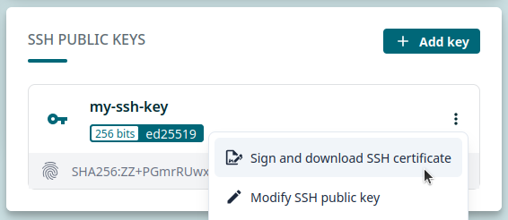

# Working with SSH certificates

> ‼️ To begin, make sure you have a user account at CSC that is a member of a project which has access to the Roihu and Allas services. Note that there’s a small delay before one can login to Roihu after creating a new project and adding services.
>
> 💬 SSH keys and certificates improve security and ease-of-use. They are required to be able to log in to Roihu from the terminal using an **SSH client**.
>
> ☝🏻 SSH keys and certificates are **not** necessary if you only use the browser-based web interfaces to log in to Roihu.
>
> ‼️ Before starting this tutorial, make sure you have [set up your SSH keys](ssh-keys.md).

## Option 1: Using the CSC certificate helper tool

💬 CSC has developed a Python helper tool for signing and downloading an SSH certificates, and adding it to your SSH agent.

💡 This is the recommended way to get your SSH certificate for logging in to Roihu using an SSH client!

### Windows

1. [Download the certificate helper tool here](https://raw.githubusercontent.com/CSCfi/certificate-helper-tool/refs/heads/main/csc_cert.py) (right-click link and select _Save Link As..._).
2. Check if you have Python installed on your computer:
   1. Open PowerShell or MobaXterm terminal.
   2. Type `python3` and hit `Enter`.
   3. If this opens a Python interpreter, you're good to go!
   4. If you get an error, you need to install Python. [Python downloads are available here](https://www.python.org/downloads/).
      - This may require admin privileges, so please be in contact with your local IT-support if necessary.
      - If Python for some reason cannot be installed on your computer, [please proceed with Option 2 instead](#option-2-manually-signing-and-downloading-certificate-in-mycsc).
3. Optional, but **strongly recommended**: Make sure you have an **SSH authentication agent** running. There are two options:
   1. **Pageant** & **WinSCP** will enable automatic adding of SSH keys and certificates to Pageant SSH agent.
      - This is recommended for users logging in to Roihu using **PuTTY** or **MobaXterm GUI**.
      - Pageant comes bundled with both PuTTY and WinSCP installations. [Instructions for installing WinSCP are available here](https://winscp.net/eng/docs/installation).
      - [Start Pageant following the instructions here](https://the.earth.li/~sgtatham/putty/0.83/htmldoc/Chapter9.html#pageant).
   2. `ssh-agent` utility will enable adding automatic adding of SSH keys and certificates to OpenSSH agent.
      - This is recommended for users logging in to Roihu using **PowerShell** or **MobaXterm terminal**.
      - [Start `ssh-agent` in PowerShell following the instructions here](https://learn.microsoft.com/en-us/windows-server/administration/openssh/openssh_keymanagement#user-key-generation) (requires admin privileges!).
      - Start `ssh-agent` in MobaXterm terminal by running:

        ```bash
        eval $(ssh-agent -s)
        ```

   ‼️ **Important note:** SSH agent is not mandatory to sign and download SSH certificates for Roihu, but using it makes connecting much easier (e.g. no need to type SSH passphrase every time).

   ☝🏻 Using SSH agent is also a prerequisite to be able to move files directly between Roihu and other CSC services (like Puhti or LUMI).

4. Open PowerShell and run the certificate helper tool for example like this:

   ```bash
   # Please change the paths and usernames (localuser, cscuser) as needed
   python3 C:\Users\localuser\Downloads\csc_cert.py -u cscuser C:\Users\localuser\.ssh\id_ed25519.pub
   ```

### Linux/macOS

## Option 2: Manually signing and downloading certificate in MyCSC

1. Log in to [MyCSC](https://my.csc.fi) with your CSC or Haka/Virtu credentials.
2. Select _Profile_ from the left-hand navigation or the dropdown menu in the top-right corner.
3. Locate _SSH PUBLIC KEYS_ section and click the three vertical dots next to the public key you want to sign.
4. Click _Sign and download SSH certificate_. As a security measure, you may be asked to log in again.

   

5. **Recommended:** Move `cert.pub` certificate file to the same folder where you store your SSH keys and rename it as `<ssh private key name>-cert.pub`. For example, `id_ed25519-cert.pub`.
6. You may now log in to Roihu using an SSH client! [This is covered in the next tutorial](ssh-roihu.md).

## More information

💭 Docs CSC: More information about [connecting](https://docs.csc.fi/computing/connecting/) and [SSH keys and certificates](https://docs.csc.fi/computing/connecting/ssh-keys/).
